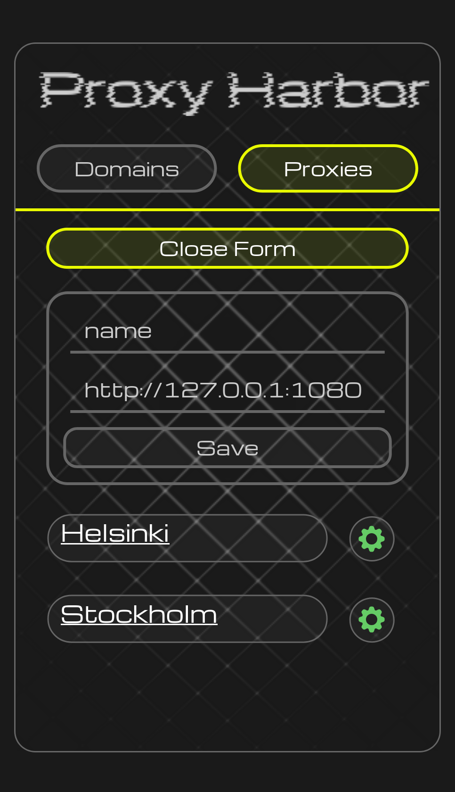
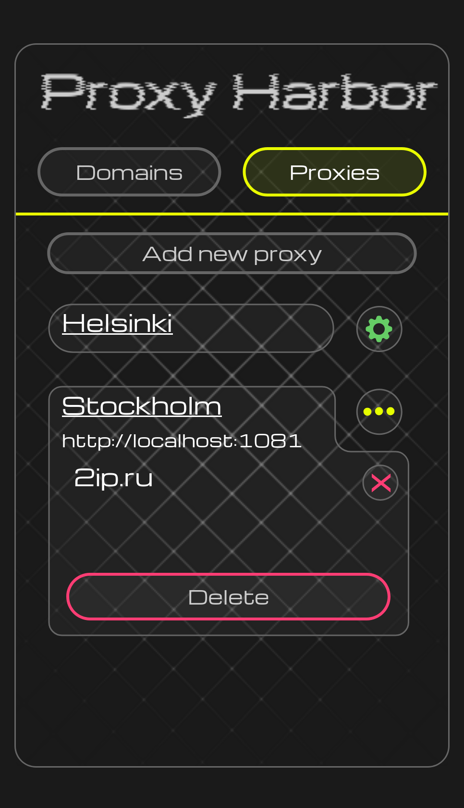
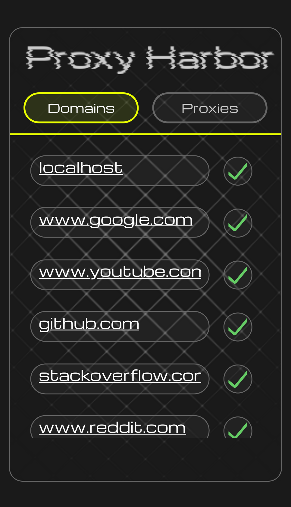
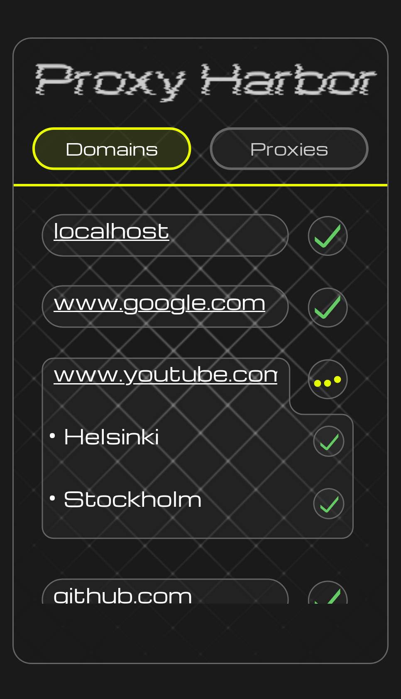

# 🌊 Proxy Harbor

> Modern browser extension UI for managing proxy rules and quickly assigning domains to proxy servers.

---

## ✨ Overview

**Proxy Harbor** is a lightweight SPA (Single Page Application) designed to simplify working with proxy configurations directly from your browser.

It provides:

- ⚡ Fast management of proxy rules
- 🌐 Quick assignment of domains to proxies
- 🧠 Live sync between browser tabs and proxy state
- 🎛️ Clean and minimal UI for productivity

Built as a **Firefox extension (Manifest V3)** with a modern React + Vite stack.

---

## 🖼️ Screenshots

### Proxy management



### Active proxies



### Browser tabs integration



### Active tab view



---

## 🧩 Features

### Proxy system

- Create, edit, and delete proxy rules
- Assign domains to specific proxy servers
- Update rules dynamically without reload

### Browser integration

- Read active Chrome/Firefox tabs
- Attach domains directly from tabs
- Real-time sync with proxy state

### UI/UX

- Animated transitions (GSAP)
- Responsive modular components
- Custom UI system (buttons, inputs, labels)

---

## 🧱 Tech Stack

- ⚛️ React 19
- ⚡ Vite
- 🟦 TypeScript
- 🎨 SCSS + modular CSS
- 🧠 Zustand (state management)
- 🔗 Axios
- 🎞 GSAP animations
- 🧩 Firefox WebExtension API (Manifest V3)

---

## 📁 Project Structure

```
src/
 ├── modules/        # Feature modules (Proxy, Tabs, UI, etc.)
 ├── shared/         # Reusable UI, hooks, utils
 ├── pages/          # Main pages
 ├── App.tsx         # Root component
 └── index.tsx       # Entry point
```

Each module is fully isolated and contains:

- `components/`
- `api/`
- `store/`
- `styles/`
- `types/`

---

## 🚀 Getting Started

### 1. Install dependencies

```bash
pnpm install
```

### 2. Run development mode

```bash
pnpm dev
```

App will be available at:

```
http://localhost:3000
```

---

### 3. Build extension

```bash
pnpm build
```

Output will be in:

```
dist/
```

---

### 4. Load extension in Firefox

1. Open `about:debugging#/runtime/this-firefox`
2. Click **“Load Temporary Add-on”**
3. Select `dist/manifest.json`

---

### 🔗 Backend Integration

This project works together with a separate backend service located in a different repository:

👉 Backend repository: [proxy_harbor_api](https://github.com/Chermi6267/proxy_harbor_api)

The frontend (this project) and backend are tightly coupled via API contracts, so both repositories must be compatible in terms of:

API endpoints
Request/response schemas
Environment configuration (see next step)

---

## ⚙️ Environment Variables

```ts
VITE_API_NODE_ENV;
VITE_API_API_URL;
```

Used in:

```ts
export const NODE_ENV = String(import.meta.env.VITE_API_NODE_ENV);
export const API_URL = String(import.meta.env.VITE_API_API_URL);
```

---

### 🧭 Firefox Proxy Configuration

To use Proxy Harbor correctly, you must configure Firefox to route traffic through the proxy server provided by the backend ([proxy_harbor_api](https://github.com/Chermi6267/proxy_harbor_api)).

🔧 Setup steps (Firefox)

1. Open **Firefox Settings**
2. Go to **Network Settings** (or search “Proxy” in settings)
3. Scroll to **Manual proxy configuration**
4. Set the proxy fields according to your backend server:
   _ **HTTP Proxy**: 127.0.0.1
   _ **Port**: 5550 (or the port exposed by proxy_harbor_api) - Apply the same proxy for HTTPS if needed
5. Enable:
   “Use this proxy server for all protocols”

---

## 🔐 Permissions (Manifest V3)

- `tabs` — access browser tabs
- `activeTab` — interact with current tab
- `host_permissions`:
  - `http://localhost:5550/*`
  - `http://localhost:5551/*`

---

## 📦 Key Modules

### Proxy Catalog

Manages proxy rules CRUD operations and UI rendering.

### Browser Tabs

Tracks browser tabs and links them with proxy domains.

### Add Proxy Menu

UI for creating new proxy entries.

### View Mode

Controls UI state (proxy view / tab view).

---

## 🧠 Architecture Notes

- Zustand stores are used per module (no global monolith store)
- API logic is separated from UI components
- Shared UI system prevents duplication across modules
- Strict feature isolation for scalability

---

## 🧪 Build Output

After build:

```
dist/
 ├── index.html
 ├── assets/
 ├── icons/
 └── manifest.json
```

---

## 🧑‍💻 Author

Built by **Chermi6267**
